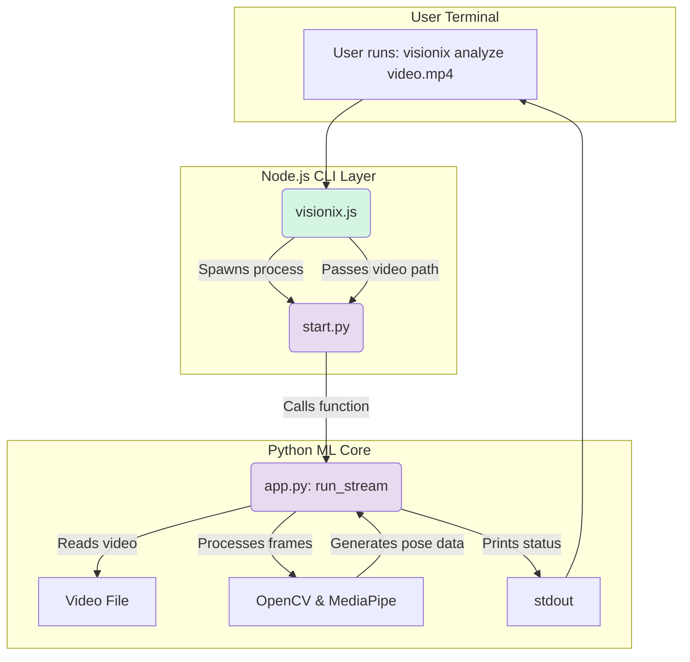
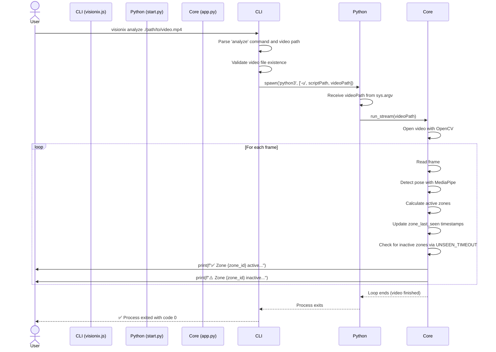
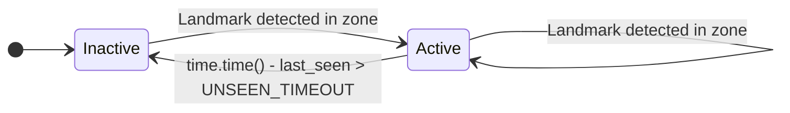

### VisionixAI Technical Documentation

This document provides a comprehensive technical overview of the VisionixAI system, a command-line tool designed for real-time pose detection and zone-based activity analysis from video files.

### 1. System Overview

VisionixAI is a hybrid system utilizing a Node.js Command Line Interface (CLI) to orchestrate a powerful Python-based machine learning core. Its primary function is to process a video stream, identify human poses within it, and track which zones of a predefined grid are occupied. The system reports the active/inactive status of each zone in real-time, making it suitable for applications like security monitoring, retail analytics, or interactive installations.

**Core Features:**

*   **CLI-Driven Operation:** A simple and scriptable command-line interface (`visionix`) for initiating analysis and setup.
*   **Automated Environment Setup:** A one-time `setup-ml` command creates a dedicated Python virtual environment and installs all necessary dependencies.
*   **Pose Detection:** Leverages Google's MediaPipe library to accurately detect and track 33 different body landmarks in real-time.
*   **Grid-Based Zone Tracking:** Divides the video frame into a configurable grid (e.g., 3x3) and monitors human presence within each zone.
*   **Real-time Activity Triggering:** Reports the status of each zone as "ON" (active) or "OFF" (inactive) based on a configurable timeout, providing a simple mechanism for triggering external events.
*   **Visual Feedback:** Renders the video with an overlay showing the grid, detected pose landmarks, and provides console output for zone status.

**Technology Stack:**

*   **CLI & Orchestration:** Node.js, `child_process`
*   **ML & Video Processing:** Python 3
*   **Computer Vision:** OpenCV (`cv2`)
*   **Pose Estimation:** MediaPipe

---

### 2. System Architecture

The system is composed of two main parts: a Node.js CLI layer and a Python ML Core. The CLI acts as the user-facing entry point and process manager, while the Python core handles all the heavy lifting of video processing and machine learning.

*   **Node.js CLI Layer (`cli/`):** This layer is responsible for parsing user commands, validating inputs (like file paths), and spawning the Python script as a separate process. It bridges the gap between the user's shell and the ML logic.
*   **Python ML Core (`ml-core/`):** This self-contained module performs the video analysis. It reads the video file, processes each frame, runs the pose detection model, calculates zone activity, and prints the results to standard output.

The following diagram illustrates the high-level interaction between these components when a user initiates an analysis.



**Component Breakdown:**

| File Path                  | Language | Role                                                                                             |
| -------------------------- | -------- | ------------------------------------------------------------------------------------------------ |
| `cli/bin/visionix.js`      | JS       | **Main CLI Entry Point.** Parses `analyze` and `setup-ml` commands. Spawns the Python process.     |
| `cli/bin/scripts/setup-ml.js` | JS       | **ML Environment Setup.** Creates a Python virtual environment and installs dependencies via `pip`. |
| `cli/lib/runner.js`        | JS       | A utility module for running the Python analysis script. Provides path resolution and spawning logic. |
| `cli/ml-core/start.py`     | Python   | **Python Bootstrapper.** Receives the video path from the CLI and calls the main processing function. |
| `cli/ml-core/app.py`       | Python   | **Core ML Logic.** Contains all video processing, pose detection, and zone tracking algorithms.      |

---

### 3. Execution Workflows

This section details the primary operational flows of the VisionixAI system.

#### Workflow 1: First-Time Environment Setup

Before any analysis can be run, the Python environment must be prepared. This is a one-time operation.

**Execution Steps:**

1.  The user runs the command `visionix setup-ml` in their terminal.
2.  The `visionix.js` script identifies the `setup-ml` command.
3.  It then `require`s and executes the `cli/bin/scripts/setup-ml.js` script.
4.  `setup-ml.js` performs two main actions using `child_process.execSync`:
    a. It creates a Python virtual environment at `cli/.visionix-venv`.
    b. It activates the environment's `pip` to install the packages listed in `cli/ml-core/requirements.txt`.
5.  Output from the setup process is streamed directly to the user's terminal.

```javascript
// File: cli/bin/scripts/setup-ml.js

// Creates the virtual environment
execSync(`python3 -m venv ${venvDir}`, { stdio: 'inherit' });

// Installs dependencies from requirements.txt
execSync(`${venvDir}/bin/pip install -r ${requirements}`, { stdio: 'inherit' });
```

#### Workflow 2: Running a Video Analysis

This is the primary workflow for using the system.

**Execution Sequence:**

The following diagram illustrates the sequence of events when a user runs the `analyze` command.



**Data Flow:**

1.  **Input:** The absolute path to a video file is passed as a command-line argument from `visionix.js` to `start.py`.
2.  **Frame Processing:** `app.py` uses `cv2.VideoCapture` to read the video frame by frame. Each frame is an OpenCV image (NumPy array).
3.  **Color Conversion:** The frame is converted from BGR (OpenCV's default) to RGB, as this is the format MediaPipe expects.
    ```python
    # File: cli/ml-core/app.py
    rgb = cv2.cvtColor(frame, cv2.COLOR_BGR2RGB)
    results = pose.process(rgb)
    ```
4.  **Pose Landmarks:** MediaPipe's `pose.process()` returns a `results` object. If a pose is detected, `results.pose_landmarks` contains the normalized `(x, y, z)` coordinates for 33 body landmarks.
5.  **Zone Mapping:** The normalized coordinates are converted to pixel coordinates. The `get_zone()` function then maps these pixel coordinates to a specific grid cell ID (e.g., `"1-2"`).
6.  **State Management:** The `zone_last_seen` dictionary is the system's state. It stores the last time (`time.time()`) a landmark was detected in each zone.
7.  **Output:** The system prints the status of every zone to `stdout` on each frame. `visionix.js` uses the `{ stdio: 'inherit' }` option in `spawn` to ensure this output is displayed directly in the user's terminal.

---

### 4. ML Core Deep Dive (`app.py`)

The `app.py` script is the heart of the system. It contains all the logic for computer vision and activity analysis.

#### Configuration Parameters

These constants at the top of `app.py` allow for easy tuning of the system's behavior.

*   `GRID_ROWS = 3`: The number of horizontal divisions in the grid.
*   `GRID_COLS = 3`: The number of vertical divisions in the grid.
*   `UNSEEN_TIMEOUT = 5`: The number of seconds a zone can be empty before it's declared "inactive".

To change the grid to a 5x5 configuration, a developer would simply modify these values:
```python
# File: cli/ml-core/app.py
GRID_ROWS = 5
GRID_COLS = 5
UNSEEN_TIMEOUT = 2 # Make the trigger more sensitive
```

#### Zone State Management

The system tracks the state of each zone (e.g., "0-0", "0-1", etc.) using a combination of a dictionary and a timeout.

*   `zone_last_seen = {}`: A dictionary mapping a `zone_id` string to the Unix timestamp of the last detection in that zone.
*   `active_zones = set()`: A temporary set on each frame to hold zones where landmarks are currently detected.

The state logic for a single zone can be visualized as follows:



**State Logic Implementation:**

This logic is executed for every zone on every frame.

```python
# File: cli/ml-core/app.py

now = time.time()
for i in range(GRID_ROWS):
    for j in range(GRID_COLS):
        zone_id = f"{i}-{j}"
        last_seen = zone_last_seen.get(zone_id, 0) # Get last seen time, default to 0
        elapsed = now - last_seen

        if elapsed > UNSEEN_TIMEOUT:
            # If the time since last seen exceeds the timeout, the zone is OFF
            print(f"⚠️ Zone {zone_id} inactive for {int(elapsed)}s → Trigger: OFF")
        else:
            # Otherwise, the zone is considered ON
            print(f"✅ Zone {zone_id} active → Trigger: ON")
```

#### Headless Operation

The system can be run without a GUI window for server-side or automated environments. To enable headless mode, comment out the `cv2.imshow` and `cv2.waitKey` lines in `app.py`.

```python
# File: cli/ml-core/app.py

# ... inside the while loop ...

# Comment below to run headless
# cv2.imshow("VisionixAI", frame)
# if cv2.waitKey(1) & 0xFF == ord('q'):
#     break
```

---

### 5. CLI and Process Management

The Node.js scripts manage the user experience and the execution of the Python core.

#### Main Entry Point (`visionix.js`)

This script is configured as an executable in `package.json` (not provided, but implied). It acts as a router for user commands.

*   **Command Parsing:** It reads `process.argv` to determine the command (`analyze`, `setup-ml`) and any associated arguments (e.g., video path).
*   **Input Validation:** Before launching the analysis, it performs critical checks using the `fs` module to ensure the Python script and the input video file both exist. This prevents runtime errors in the Python process.
    ```javascript
    // File: cli/bin/visionix.js
    if (!fs.existsSync(scriptPath)) {
      console.error(`❌ start.py not found at: ${scriptPath}`);
      process.exit(1);
    }
    if (!input || !fs.existsSync(input)) {
      console.error(`❌ Input video not found: ${input}`);
      process.exit(1);
    }
    ```
*   **Process Spawning:** It uses `child_process.spawn` to run `start.py`. Key options used are:
    *   `'-u'`: This flag is passed to `python3` for unbuffered binary stdout and stderr, ensuring that output from the Python script is printed in real-time rather than being held in a buffer.
    *   `{ stdio: 'inherit' }`: This is crucial. It pipes the `stdin`, `stdout`, and `stderr` of the child process directly to the main Node.js process, making the Python script's output appear seamlessly in the user's terminal.

#### Utility Runner (`runner.js`)

The `runner.js` file provides a more modular way to execute the Python script. While `visionix.js` contains its own spawning logic, `runner.js` encapsulates this functionality. It demonstrates a robust way to resolve the path to `start.py` from its own location, making it resilient to where the script is called from.

```javascript
// File: cli/lib/runner.js

function runAnalysis(videoPath) {
  // Navigate two levels up from cli/lib/ to root, then into ml-core
  const rootPath = path.resolve(__dirname, '..', '..');
  const pythonPath = path.join(rootPath, 'ml-core', 'start.py');

  // ... spawn logic ...
}
```
This module could be used by other parts of a larger Node.js application that need to trigger the analysis programmatically.

---

### 6. Troubleshooting and Common Issues

*   **Error: `❌ start.py not found`**
    *   **Cause:** The Node.js script cannot locate the Python entry point. This is usually due to a file being moved or an incorrect path resolution.
    *   **Solution:** Verify that the `ml-core/start.py` file exists relative to the `cli/` directory. The error message prints the exact path that was checked.

*   **Error: `❌ Input video not found`**
    *   **Cause:** The video path provided to the `analyze` command is incorrect or the file does not exist.
    *   **Solution:** Ensure you are providing a correct relative or absolute path to the video file.

*   **Error: `ModuleNotFoundError: No module named 'cv2'` (or `mediapipe`)**
    *   **Cause:** The Python dependencies are not installed, or the script is not being run within the correct virtual environment.
    *   **Solution:** Run the setup command: `visionix setup-ml`. This will create the `.visionix-venv` and install all required packages. The CLI should automatically use this environment, but if running manually, ensure it's activated.

*   **Error: `❌ Cannot open video.`**
    *   **Cause:** This error comes from OpenCV within `app.py`. It means that while the file path was valid, OpenCV was unable to read or decode the video stream. This can happen with corrupted files or unsupported video codecs.
    *   **Solution:** Try converting the video to a standard format like H.264 MP4. Verify the file is playable in a standard video player.
